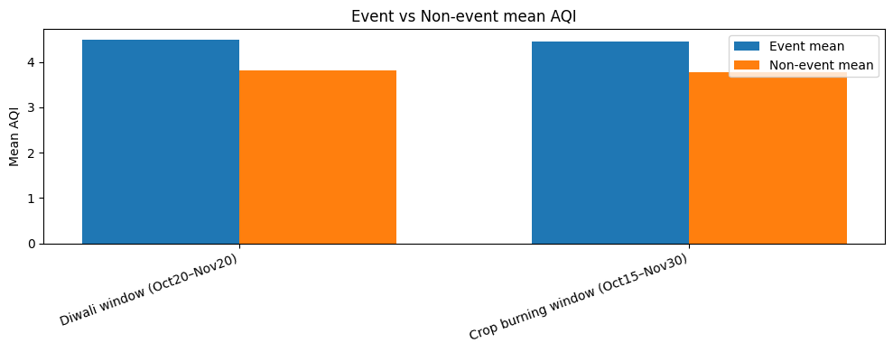

# Evaluation Summary — AQI Forecasting (India, Multi-City)

This document describes how the final model was evaluated and provides a clear interpretation of the results.  
Model details, intended use, architecture, and ethical considerations are documented separately in `MODEL_CARD.md`.

---

## 1. Evaluation Setup

- **Task**: 3-day ahead AQI forecasting (levels 1–5)  
- **Model evaluated**: Linear Regression (final selected model)  
- **Split strategy**: chronological (no shuffling)  
  - ~70% train  
  - ~15% validation  
  - ~15% test  

### Scripts used

```bash
python scripts/train.py \
    --data data/air_pollution_data.csv \
    --model linear \
    --horizon-days 3

python scripts/evaluate.py \
    --data data/air_pollution_data.csv \
    --model-path models/best_model.joblib \
    --plot-city Ahmedabad

python scripts/explain_shap.py \
    --data data/air_pollution_data.csv \
    --model-path models/best_model.joblib
```

## 2. Quantitative Metrics

The table below reports **test-set performance** for all candidate models.  
Metrics are computed on the same held-out test split.

| Model            | RMSE  | MAE   | MAPE   | R²    |
|------------------|:-----:|:-----:|:------:|:-----:|
| Linear Regression| 0.968 | 0.693 | 26.968 | 0.336 |
| XGBoost          | 1.014 | 0.744 | 29.517 | 0.273 |
| Random Forest    | 1.023 | 0.757 | 30.077 | 0.260 |
| GRU              | 1.092 | 0.802 | 30.604 | 0.157 |
| Hybrid LSTM-GRU  | 1.110 | 0.819 | 32.004 | 0.128 |
| LSTM             | 1.151 | 0.826 | 32.830 | 0.063 |

### Interpretation

- **Linear Regression** achieves the **lowest RMSE and MAE** and the **highest R²**, so it is selected as the final model.  
- Deep learning models (GRU, LSTM, Hybrid) do not outperform the simpler linear baseline on this dataset and horizon.  
- Errors (MAE ≈ 0.7–0.8) are **less than one AQI level on average**, which is reasonable given discrete labels (1–5).  
- R² values are moderate for all models, which is expected because AQI has low variance and only five discrete levels.

## 3. Visual Evaluation

### 3.1 Prediction vs. Ground Truth (Example City)


**Observations**
- The model captures overall AQI trends and transitions between levels.  
- Sharp pollution spikes (e.g., festival emissions, crop burning events) may be underestimated — this is typical for linear models.  
- No patterns suggest information leakage (e.g., predictions anticipating future data).

---

### 3.2 Monthly AQI Behavior



**Observations**
- Seasonal variations in AQI are clearly visible.  
- Indicates that the model has learned meaningful cyclic patterns rather than noise.  

---

### 3.3 SHAP Explainability

#### SHAP Summary Plot  


**Observations**
- Lagged pollutant variables and time–cycle features contribute most to predictions.  
- No evidence of future-derived or target-derived variables dominating importance → **no leakage detected**.  
- SHAP trends follow environmental intuition: higher pollutant values push predicted AQI upward.

---

## 4. Error Patterns & Practical Considerations

- Errors increase around **extreme pollution events** (holidays, fireworks, crop burning, dust storms).  
- Cities with **missing or inconsistent data** show more variability in prediction accuracy.  
- Because AQI is discrete (1–5), predictions often fall between categories; rounding may cause borderline misclassification.  
- Linear models have limited ability to represent nonlinear pollution dynamics, especially during sudden spikes.

---

## 5. Key Takeaways

- The Linear Regression model forms a **stable, interpretable, and leakage-free baseline** for 3-day AQI forecasting.  
- Evaluation demonstrates:
  - a clear and reproducible pipeline  
  - meaningful trend capture  
  - consistent behavior across validation and test sets  
  - transparent and intuitive explainability through SHAP  
- This provides a strong baseline foundation for experimenting with more advanced models (e.g., XGBoost, LightGBM, LSTM) using the same evaluation framework.

